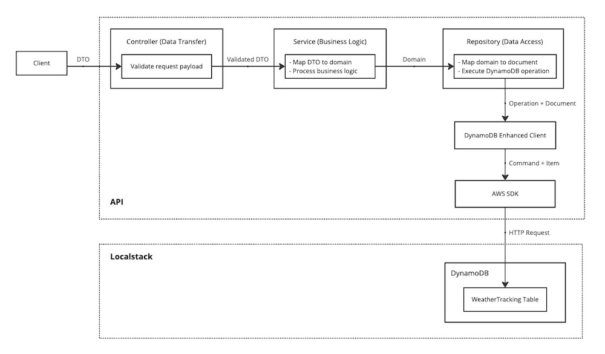

# Mini Project: Weather Tracking API

> This project is currently in development

## About

REST API for weather tracking device registration and capture tracking data i.e. temperature, humidity, etc.

### Tech Stack

- [Spring Boot](https://spring.io/projects/spring-boot)
- [SpringDoc OpenAPI](https://springdoc.org/)
- [DynamoDB](https://aws.amazon.com/dynamodb/)
- [Localstack](https://www.localstack.cloud/)
- [Maven](https://maven.apache.org/)
- [Lombok](https://projectlombok.org/)
- [JUnit](https://junit.org/junit5/)
- [Mockito](https://site.mockito.org/)
- [Testcontainers](https://testcontainers.com/)

### Application Design



## Getting started

### Pre-requisite

- [JDK version 17](https://openjdk.org/)
- [Docker](https://www.docker.com/)
- [IntelliJ IDE (Recommended)](https://www.jetbrains.com/idea/)

### Run Unit Testing

```shell
# To run unit test files (*Test.java)
./mvnw test
```

### Run Integration Testing

```shell
# To run unit and integration test files (*IT.java) with DynamoDB on Localstack Testcontainer
./mvnw integration-test
```

### Build Application Artifact

```shell
# To create app.jar in `target` directory
./mvnw clean install
```

### Run Application with DynamoDB on Localstack

```shell
# To build Docker image to run with docker-compose.yml file
./start.sh
```

### Open API specification

Go to `http://localhost:8080/swagger-ui/index.html` after running `start.sh` script
